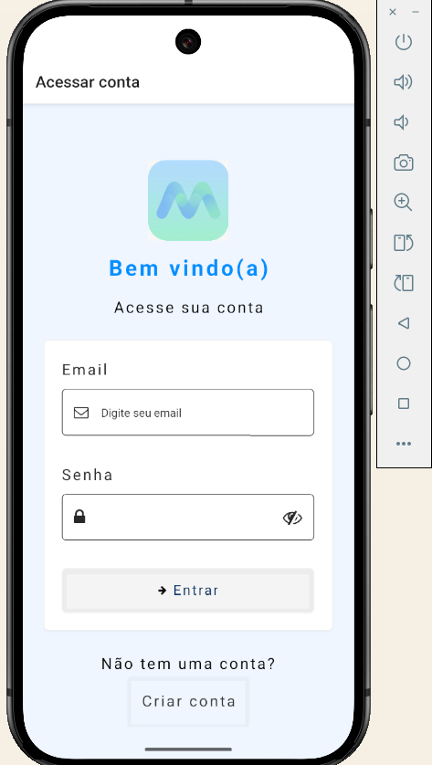
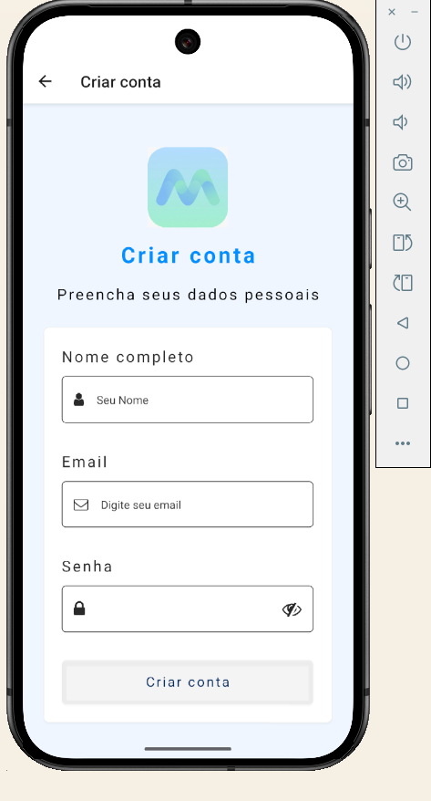
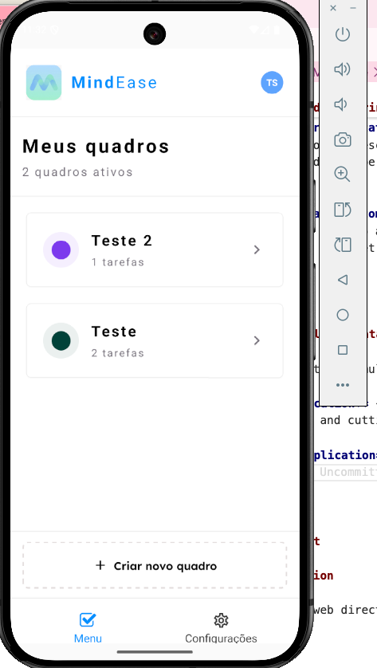
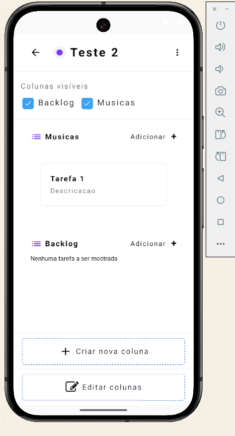
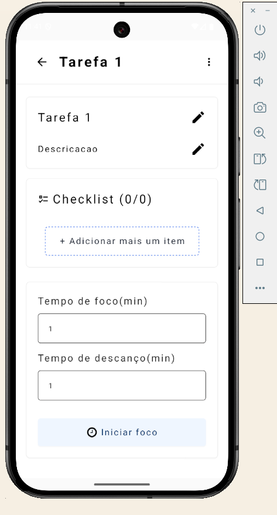

# 🧠 MindEase

O **MindEase** é uma plataforma de organização e produtividade desenhada sob a ótica da **Psicologia das Cores** e da **Acessibilidade Cognitiva**. O projeto nasceu para resolver o desafio de usuários que sofrem com sobrecarga sensorial, fotofobia ou neurodivergências (como TDAH e Autismo), onde interfaces padrão com alto brilho e excesso de informações podem ser paralisantes.

---

## 🚀 Principais funcionalidades

- **Painel de Configuração Cognitiva:** permite ao usuário personalizar a complexidade da interface, níveis de contraste (Baixo, Moderado, Alto) e perfis de uso para reduzir a sobrecarga sensorial.

- **Modo Foco com Isolamento Visual:** ao iniciar uma tarefa, o sistema oculta distrações externas, mantendo em evidência apenas o cronômetro e as informações essenciais da atividade em curso.

- **Gestão de Tarefas e Checklists:** sistema de criação de tarefas com títulos, descrições e checklists inteligentes para decompor atividades complexas em etapas menores.

- **Timer Pomodoro Adaptativo:** cronômetro configurável para tempos de foco e descanso, com variações visuais de progresso ajustadas ao perfil de contraste escolhido pelo usuário.

- **Modo de Descanso Automático:** transição imediata para uma interface de repouso após o fim do foco, com mensagens de acolhimento e cronômetro de pausa automático.

---

## 📱 Tecnologias Utilizadas

### Web

- **Vite:** Build tool de próxima geração utilizada para garantir um ambiente de desenvolvimento ultra-rápido e otimização de performance no bundle final.

- **React Router Dom (v7):** Gerenciamento de rotas e navegação declarativa na versão web.

- **Ant Design (v6):** Biblioteca de componentes de UI utilizada para acelerar o desenvolvimento com elementos consistentes e acessíveis.

- **Linaria:** Utilizada para CSS-in-JS com zero runtime, garantindo que os estilos sejam extraídos para arquivos CSS estáticos durante o build, otimizando o carregamento da página.

- **Polished:** Conjunto de ferramentas leves para manipular cores e estilos diretamente no código (útil para os cálculos de contraste dinâmico).

#### 🛠️ Gestão de Dados & Utilitários

- **TanStack React Query Devtools:** Ferramenta de inspeção para monitorar o estado das requisições e cache de dados em tempo real durante o desenvolvimento.

- **Dayjs:** Biblioteca leve para manipulação e formatação de datas (essencial para a lógica de calendários e histórico de tarefas).

- **Lodash:** Conjunto de utilitários para manipulação de arrays e objetos, garantindo um código mais limpo e performático.

- **Sonner:** Sistema de notificações (toasts) altamente personalizável e elegante para feedbacks de ações do usuário.

- **Zustand (v5):** Mesma solução de estado global utilizada no Mobile, garantindo paridade de lógica entre as plataformas para as configurações de contraste e acessibilidade.

#### 🧪 Qualidade de Código & Testes

- **TypeScript (v5.9):** Superset JavaScript que adiciona tipagem estática, reduzindo erros em tempo de desenvolvimento e melhorando a manutenção do código.

- **Vitest:** Framework de testes unitários focado em velocidade, utilizado para validar as lógicas de cálculo de tempo e transições de estado.

- **ESLint & Prettier:** Conjunto de ferramentas para garantir a padronização do código e prevenir erros comuns de sintaxe e estilo.

- **Env-cmd:** Gerenciamento de variáveis de ambiente para diferentes contextos (desenvolvimento, homologação e produção).

### Mobile

- **Expo (v54):** Framework para desenvolvimento nativo e acesso a APIs do dispositivo.
- **React (v19) & React Native (v0.81):** Base para construção da interface e lógica mobile.
- **Expo Router (v6):** Sistema de navegação baseado em arquivos.

#### Estilização & UI

- **NativeWind (v4) & Tailwind CSS (v3):** Estilização baseada em utilitários para implementação de tokens de design.
- **Class Variance Authority (CVA):** Gerenciamento de variantes de componentes (botões e cards).
- **Google Fonts:** Integração das fontes `Lexend`, `JetBrains Mono` e `Bitter` para máxima legibilidade.

#### Gerenciamento de Estado & Dados

- **Zustand:** Gerenciamento de estado global para preferências de perfil e configurações de contraste.
- **TanStack React Query (v5):** Sincronização de dados e gerenciamento de cache.
- **Axios:** Cliente HTTP para consumo de APIs.

#### UX & Interação

- **React Native Reanimated (v4):** Engine de animações para transições suaves de cores e estados.
- **Expo AV:** Execução de sons ambientais durante o modo foco.
- **Expo Haptics:** Feedback tátil para interações do usuário.
- **Toastify React Native:** Sistema de notificações sutil para alertas de transição.

#### Formulários & Validação

- **React Hook Form:** Controle de formulários de criação de tarefas.
- **Yup:** Validação de esquemas e dados de entrada.

---

## 🚀 Executando a aplicação

#### Pré-requisitos

- Node.js (v18 ou superior)
- npm ou yarn
- Navegador moderno

#### Clonando o respositório

```bash
git clone https://github.com/lucasvss2/MindEase.git

cd MindEase
```

### Web

Acesse o diretório web e siga as instruções de configuração:

```bash
cd mind-ease-web
npm install

npm run dev
```

Para obter informações detalhadas sobre a configuração e a documentação da web, consulte[mind-ease-web/README.md](./mind-ease-web/README.md)

### Mobile

Acesse o diretório de dispositivos móveis e siga as instruções de configuração:

```bash
cd mind-ease-mobile
npm install
```

```bash
npx expo run:android
```

Ou

```bash
npx expo run:ios
```

> **Note**: O aplicativo móvel foi desenvolvido com **React Native** e requer configuração adicional para ambientes de desenvolvimento iOS e Android.

---

## 💻 📱 Visão geral da plataforma

### 🌐 **Web**

//Add imagens

### 📱 **Mobile**












## 📄 Licença


#### Este projeto é privado e de propriedade exclusiva.
---

## 🙏 Agradecimentos

Construído com ❤️ pela equipe de desenvolvimento da MindEase.

Um agradecimento especial à comunidade de código aberto pelas incríveis ferramentas e bibliotecas que tornam este projeto possível.

---

**MindEase** - MindEase - Apoiando o bem-estar mental através da tecnologia 💙💙

